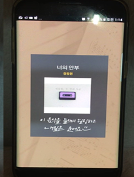

# DeepMusic_server
> Emotion recognize and recommend music app / BackEnd( Flask )

Use Google Inception V3 Model

## Input   and     Output
Input: Face Image   

Output : Music    

               

## Contributing

1. Reference http://solarisailab.com/archives/1422

